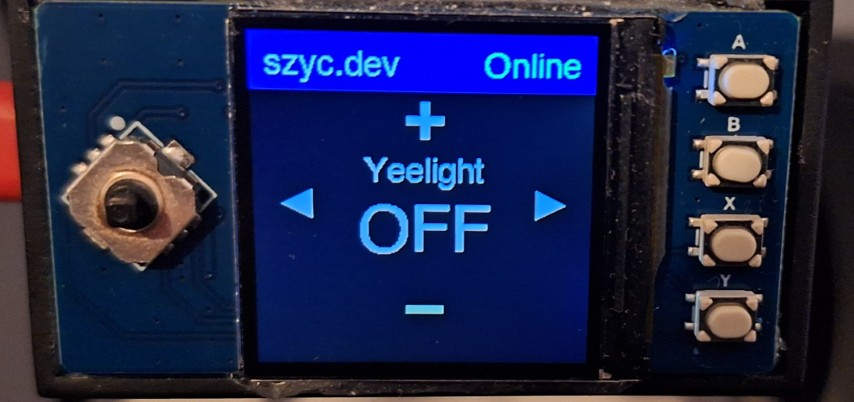
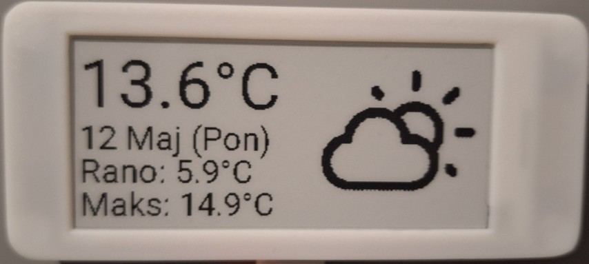

# Personal ESPHome devices source code 

## Pico Light Control
Home Assistant integrated screen with buttons for controlling lights. \
Built with:
- Raspberry Pi Pico W
- [Waveshare Pico LCD 1.3](https://www.waveshare.com/wiki/Pico-LCD-1.3)
- [3D printed case](https://www.printables.com/model/736288-raspberry-pico-rp2040-case)

## Epaper Weather Screen
Epaper screen that displays weather image and also temperature: current, morning and max for the day. \
Built with:
- ESP32-C3 Super Mini board from Aliexpress
- WeAct 2.9" ePaper screen from Aliexpress
- 3D printed case (slighty modified [this model](https://www.printables.com/model/786905-weact-29-epaper-case/files))

## Credits
1. Weather icon files \
https://github.com/AbnormalDistributions/e_paper_weather_display/tree/master/pic/icon
2. Gosund SP111 config file \
https://devices.esphome.io/devices/Gosund-SP111
